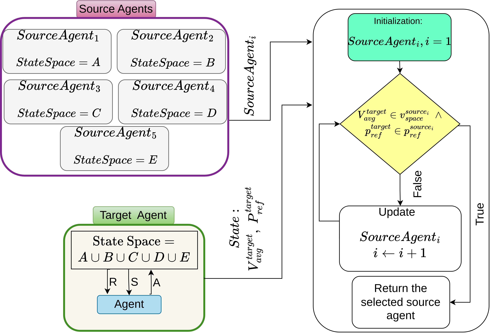

# Integrated Transfer Learning and Reinforcement Learning for Reactive Current Injection During Voltage Sags

This repository contains the implementation of the paper:

*Integrated Transfer Learning and Reinforcement Learning for Reactive Current Injection During Voltage Sags*

[//]: # (**Mohana Fathollahi, Antonio Camacho Santiago, and Cecilio Angulo**  )

[//]: # (**Energies, 2026, 19, 2908**)

## Overview

This work proposes a **unified Soft Actor-Critic (SAC) policy** for reactive current injection during voltage sags.

The proposed method combines Transfer Learning and Reinforcement Learning (RL) to improve sample efficiency and learn a generalized policy across different environments.
To achieve this, the proposed approach incorporates the following components: 

- **Multi-Source Transfer Learning**
- **Potential-Based Reward Shaping (PBRS)**
- **Learning from Demonstration (LfD)**
- **Critic-network embeddings**
- **Soft Actor Critic RL algorithm**

Five pretrained source agents are used to guide the training of a target SAC agent covering the full operating range. A source policy is selected according to the current voltage and reference-power conditions.

## Installation
Create a virtual Python 3.11.11 environment and install the required dependencies.

```bash
python -m venv .venv 
source .venv/bin/activate 
pip install -r requirements.txt
```

## Problem Formulation

**State:**
```text
[Va, Vb, Vc, Pref]
```

**Action:**
```text
[Iqa, Iqb, Iqc]
```

The target environment covers:

- Voltage: **44–93 V**
- Reference power: **100–1400 W**
- Reactive current: **2.5–10 A**

The goal is prediction action for each phase to improve the voltage in that phase.

## Method
The flowchart of the prposed method has been provided in below.
<p align="center">
  
</p>


It is important to note that, the transfer mechanism is used during **training only**. 
During inference, only the trained target actor is required.

## Results

The proposed **SAC + PBRS + MSS** method:

- Converges in approximately **600k timesteps**
- Achieves higher and more stable rewards than baseline SAC and single-source transfer
- Achieves reactive-current prediction errors mostly below **0.25 A**
- Is evaluated on **150,000 test samples**
- Has an average prediction time of approximately **0.092 s**

[//]: # (## Citation)

[//]: # ()
[//]: # (```bibtex)

[//]: # (@article{fathollahi2026integrated,)

[//]: # (  title={Integrated Transfer Learning and Reinforcement Learning for)

[//]: # (         Reactive Current Injection During Voltage Sags},)

[//]: # (  author={Fathollahi, Mohana and Camacho Santiago, Antonio and Angulo, Cecilio},)

[//]: # (  journal={Energies},)

[//]: # (  volume={19},)

[//]: # (  number={12},)

[//]: # (  pages={2908},)

[//]: # (  year={2026},)

[//]: # (  doi={10.3390/en19122908})

[//]: # (})

[//]: # (```)

**Paper:** https://doi.org/10.3390/en19122908
